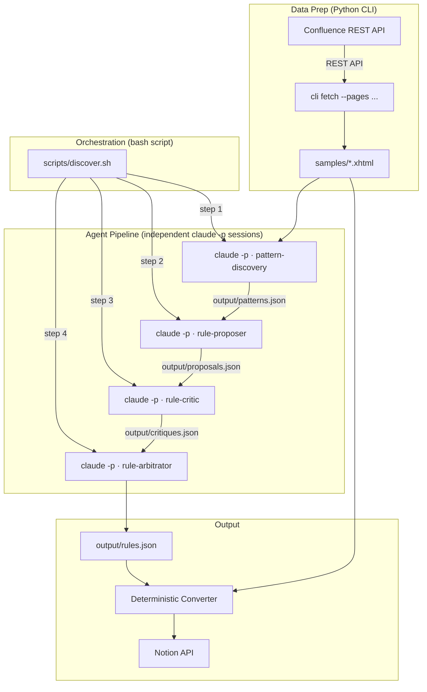

# Architecture Overview

## System Diagram



## Execution Model

Two runtime layers, each with a clear responsibility:

### 1. Python CLI (`uv run c2n ...`)

Handles I/O with external APIs. Deterministic, testable, typed.

- `fetch --pages <ids>` — download specific Confluence pages as XHTML
- `fetch --space <key>` — download pages from a space (paginated)
- `notion-ping` — validate Notion API token
- `convert` (future) — apply rules.json to transform pages
- `publish` (future) — push converted pages to Notion

### 2. Bash script + `claude -p` (Agent Pipeline)

Handles LLM-powered reasoning. Each agent runs in **its own clean `claude -p` session**.

```bash
bash scripts/discover.sh samples/
```

Internally this runs:

```
Step 1: claude -p "..." (pattern-discovery)  → output/patterns.json
Step 2: claude -p "..." (rule-proposer)      → output/proposals.json
Step 3: claude -p "..." (rule-critic)        → output/critiques.json
Step 4: claude -p "..." (rule-arbitrator)    → output/rules.json
```

### Why script-based orchestration?

| | Delegated (Claude commands) | Explicit (bash script) |
|---|---|---|
| **Orchestrator** | Claude session (LLM judgment) | Bash script (deterministic code) |
| **Context** | Accumulates in one window | Clean per step |
| **Debugging** | Hard to trace where it broke | Step 3 fails → rerun step 3 |
| **Intermediate output** | In Claude's memory | Files on disk |
| **Retry** | Rerun entire pipeline | Rerun failed step only |
| **Flow changes** | Edit .md, hope Claude follows | Edit one line of bash |

The pipeline is **linear** (Discovery → Proposer → Critic → Arbitrator). No dynamic branching needed. A script is the right tool.

## Data Flow

1. **Fetch**: `cli fetch --pages <ids>` downloads XHTML from Confluence → `samples/`
2. **Discovery**: `pattern-discovery` agent reads `samples/*.xhtml` → `output/patterns.json`
3. **Propose**: `rule-proposer` agent reads `output/patterns.json` → `output/proposals.json`
4. **Critique**: `rule-critic` validates against `samples/` → `output/critiques.json`
5. **Arbitrate**: `rule-arbitrator` resolves conflicts → `output/rules.json`
6. **Convert**: Deterministic converter applies `rules.json` to transform all pages → `output/runs/<slug>/converted/`
7. **Publish**: Converted Notion blocks pushed via the Notion API; run state recorded under `output/runs/<slug>/`

## Per-Run Artifact Layout

Every `convert` / `migrate` / `migrate-tree` / `migrate-tree-pages` invocation allocates a fresh run directory under `output/runs/<slug>/` (collisions get `-2`, `-3`, …). The slug is derived from the `--url` argument by `slug_for_url()`.

```
output/runs/<slug>/
├── source.json         # SourceInfo: url, type (page|tree|space|...), root_id, notion_target
├── status.json         # RunStatus: per-step StepRecord (fetch / discover / convert / migrate)
├── report.md           # Rendered by finalize_run() from source.json + status.json
├── resolution.json     # page_link:<title> → notion_page_id (migrate-tree / migrate-tree-pages)
├── converted/          # <page_id>.json Notion-block payloads (convert / migrate-tree-pages)
├── samples/            # XHTML bodies fetched during migrate-tree-pages Pass 1.5
├── page-tree.json      # Confluence tree snapshot (migrate-tree-pages)
└── rules/
    └── table-rules.json  # Operator-classified table rules (migrate-tree-pages)
```

Contract highlights (see `src/confluence_to_notion/runs.py`):

- **`source.json`** — persisted on first touch of a run via `start_run()`; carries the origin URL plus optional `root_id` and `notion_target`.
- **`status.json`** — one `StepRecord` per phase (`fetch`, `discover`, `convert`, `migrate`); each record tracks `status`, `at` (ISO-8601), and optional `count` / `warnings`. Mutated via `update_step()`.
- **`report.md`** — rendered by `finalize_run()` from the two files above. When a caller passes `rules_summary=`, an optional `## Rules usage` section is appended (sorted `- <rule_id>: <count>` lines).

Legacy repo-root sinks (`output/converted/`, `output/resolution.json`, `output/rules/table-rules.json`) are no longer written.

## Module Responsibility Map

| Location | Layer | Responsibility |
|---|---|---|
| `scripts/discover.sh` | Bash | Pipeline orchestration (flow control) |
| `.claude/agents/*.md` | Subagent | LLM-powered reasoning (one agent per file) |
| `output/*.json` | Data | Inter-agent communication (file-based) |
| `src/config.py` | Python | Environment-based configuration |
| `src/confluence/client.py` | Python | Async Confluence REST API client |
| `src/notion/client.py` | Python | Async Notion API wrapper |
| `src/cli.py` | Python | CLI entry points for data prep |
| `src/confluence_to_notion/runs.py` | Python | Run directory layout, status/source schemas, report rendering |
| `src/**/schemas.py` | Python | Pydantic models = contracts for agent I/O |

## Key Design Decisions

- **Script-based orchestration**: Deterministic, debuggable, step-level retry. Each `claude -p` gets a clean context.
- **File-based communication**: Agents read/write JSON. Simple, inspectable, versionable.
- **Pydantic as contract**: JSON schemas define what agents must produce. Python validates; agents generate.
- **httpx for Confluence**: Direct REST for pagination, auth, async control.
- **Python for I/O only**: `src/` handles API calls and deterministic conversion. LLM reasoning stays in subagents.

See [ADR.md](ADR.md) for architecture decision records.
