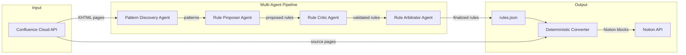

# Architecture Overview

## System Diagram

## Data Flow

1. **Fetch**: Confluence pages are fetched via REST API as XHTML storage format
2. **Discovery**: Pattern Discovery Agent analyzes XHTML samples for repeating structures and macros
3. **Propose**: Rule Proposer Agent generates Confluence→Notion block mapping rules
4. **Critique**: Rule Critic Agent validates proposed rules against additional samples
5. **Arbitrate**: Rule Arbitrator Agent resolves conflicts and produces final `rules.json`
6. **Convert**: Deterministic converter applies finalized rules to transform pages
7. **Publish**: Converted pages are created in Notion via the official API

## Module Responsibility Map

| Module | Responsibility |
|---|---|
| `config.py` | Environment-based configuration via pydantic-settings |
| `cli.py` | Typer CLI entry points for all commands |
| `confluence/client.py` | Async httpx client for Confluence REST API |
| `confluence/schemas.py` | Pydantic models for Confluence data |
| `notion/client.py` | Async wrapper over notion-client SDK |
| `notion/schemas.py` | Pydantic models for Notion data |
| `agents/<name>/agent.py` | Agent orchestration using Claude API |
| `agents/<name>/schemas.py` | Input/Output models for agent communication |
| `agents/<name>/prompts/` | Markdown prompt templates (Jinja2) |
| `prompts.py` | Shared prompt loading and rendering utility |

## Key Design Decisions

- **httpx over atlassian-python-api**: Direct REST gives us control over pagination, error handling, and async support
- **notion-client SDK**: Official SDK handles auth, rate limiting, and block construction
- **Pydantic v2 everywhere**: Type-safe data flow between agents prevents schema drift
- **Prompts as files**: Enables version control, review, and eval of prompt changes independently from code changes

See [ADR-001](adr/001-multi-agent-pattern.md) for the multi-agent pipeline decision.
