# Architecture Overview

## System Diagram

```mermaid
graph LR
    subgraph "Data Prep (Python CLI)"
        CF[Confluence REST API]
        FETCH[cli fetch]
        SAMPLES[samples/*.xhtml]
    end

    subgraph "Agent Pipeline (Claude Code Subagents)"
        D[pattern-discovery.md]
        P[rule-proposer.md]
        C[rule-critic.md]
        A[rule-arbitrator.md]
    end

    subgraph "Output"
        R[output/rules.json]
        CV[Deterministic Converter]
        N[Notion API]
    end

    CF -->|REST API| FETCH
    FETCH -->|XHTML files| SAMPLES
    SAMPLES --> D
    D -->|output/patterns.json| P
    P -->|output/proposals.json| C
    C -->|output/critiques.json| A
    A -->|output/rules.json| R
    R --> CV
    SAMPLES --> CV
    CV -->|Notion blocks| N
```



## Execution Model

There are two runtime layers:

### 1. Python CLI (`uv run cli ...`)
Handles I/O with external APIs:
- **Fetch**: Download Confluence pages as XHTML to `samples/`
- **Notion ping**: Validate Notion API token
- **Convert** (future): Apply rules.json to transform pages deterministically
- **Publish** (future): Push converted pages to Notion

### 2. Claude Code Subagents (`claude -p "/discover ..."`)
Handles LLM-powered reasoning:
- Agents are defined as `.claude/agents/<name>.md`
- Orchestrated by `.claude/commands/discover.md`
- Communicate via files on disk (JSON matching Pydantic schemas)
- Same agent definitions work interactively, via `claude -p`, and via Routines

```bash
# Interactive
/discover samples/

# Automated
claude -p "/discover samples/"

# Individual agent
claude -p "/agent pattern-discovery samples/"
```

## Data Flow

1. **Fetch**: `cli fetch --pages <ids>` downloads XHTML from Confluence to `samples/`
2. **Discovery**: `pattern-discovery` agent reads `samples/*.xhtml`, writes `output/patterns.json`
3. **Propose**: `rule-proposer` agent reads patterns, writes `output/proposals.json`
4. **Critique**: `rule-critic` agent validates proposals against samples, writes `output/critiques.json`
5. **Arbitrate**: `rule-arbitrator` agent resolves conflicts, writes `output/rules.json`
6. **Convert**: Deterministic converter applies `rules.json` to transform all pages
7. **Publish**: Converted Notion blocks are pushed via the Notion API

## Module Responsibility Map

| Layer | Location | Responsibility |
|---|---|---|
| `src/config.py` | Python | Environment-based configuration |
| `src/confluence/client.py` | Python | Async Confluence REST API client |
| `src/notion/client.py` | Python | Async Notion API wrapper |
| `src/cli.py` | Python | CLI entry points for data prep |
| `.claude/agents/*.md` | Subagent | LLM-powered reasoning tasks |
| `.claude/commands/discover.md` | Command | Pipeline orchestration |
| `output/*.json` | Data | Inter-agent communication files |

## Key Design Decisions

- **Claude Code subagents over Anthropic SDK**: One agent definition works across interactive, automated (`claude -p`), and scheduled (Routines) execution. No custom orchestration code needed.
- **File-based communication**: Agents read/write JSON files. Simple, debuggable, version-controllable.
- **Pydantic as contract**: JSON schemas from Pydantic models define what agents must produce. Python code validates; agents generate.
- **httpx for Confluence**: Direct REST gives control over pagination, auth, async.
- **Python for I/O only**: `src/` handles API calls and deterministic conversion. LLM reasoning stays in subagents.

See [ADR-001](adr/001-multi-agent-pattern.md) for the multi-agent pipeline decision.
